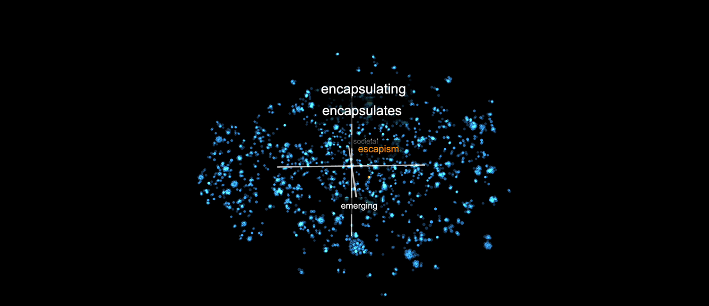

# Three Ways of Seeing

A real-time, interactive art installation that turns a machine's understanding of language into something you can walk up to and add to. A visitor types a word, and it appears live inside a 3D map of meaning, floating near the words a language model considers similar.

<p align="center"></p>
<p align="center"><em>Type "escapism" and it lands (in orange) among its nearest neighbors in the model's semantic space. Shown at the exhibition on a 34 by 15 foot screen.</em></p>

## What it is

A language model represents every word as a vector in a high dimensional space, where distance means similarity in meaning. That space is normally invisible. This installation makes it something a whole room can see and contribute to:

1. A visitor types a word on their phone or laptop.
2. A sentence-transformer model embeds the word, t-SNE projects it from 384 dimensions down to 3D, and it drops live into the shared cloud on the big screen.
3. The camera drifts through the space, so everyone watches meaning organize itself. Related words cluster, unrelated ones drift apart.

The base cloud is built from my own writing, so the space visitors explore is grown from my vocabulary.

## How it works

```
Visitor's phone / laptop              Display screen
   add_word.html          WiFi          realtime_exhibition.html
   (type a word)         hotspot        (3D Three.js visualization)
         |                                        ^
         +------------->  Python server  ---------+
                          embed + t-SNE + WebSocket broadcast
```

- **Embeddings:** the `all-MiniLM-L6-v2` sentence-transformer turns each word into a 384 dimensional vector.
- **Projection:** t-SNE reduces those vectors to 3D while preserving which words are neighbors.
- **Rendering:** Three.js draws the point cloud and word labels in WebGL.
- **Live and local:** a Python WebSocket server broadcasts each new word to the display in real time, over a self-hosted WiFi hotspot, so the whole thing runs with no internet. Both pages auto-detect the server address, so there is nothing to configure on the day.

## Repo layout

- `server.py`, `realtime_server.py`: the embedding, t-SNE, and WebSocket backend.
- `web/realtime_exhibition.html`: the 3D visualization for the big screen.
- `web/add_word.html`: the visitor input page.
- `build_base.py`, `precompute_frames.py`: build the base embedding cloud from source text.
- `config.py`: t-SNE and model settings.
- `SETUP.md`: the full run-of-show setup guide for the physical installation.

The large precomputed embedding caches (`.npy` files) are not committed. Regenerate them with `build_base.py`.
