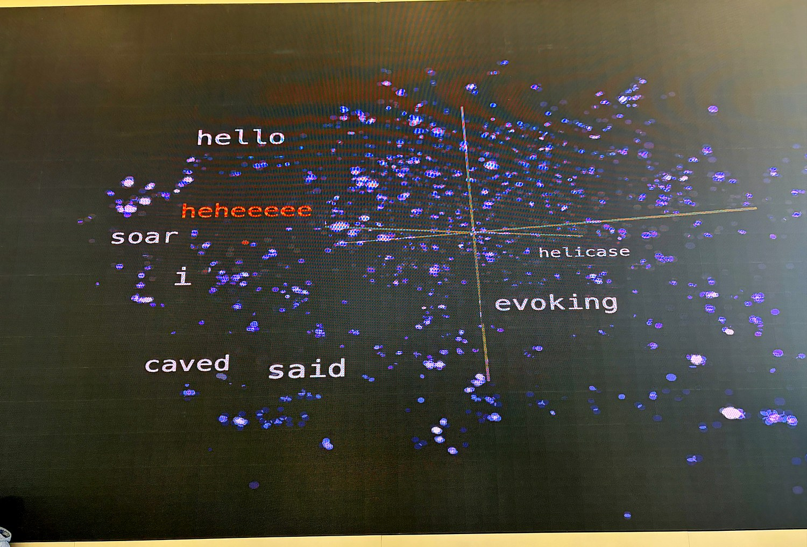
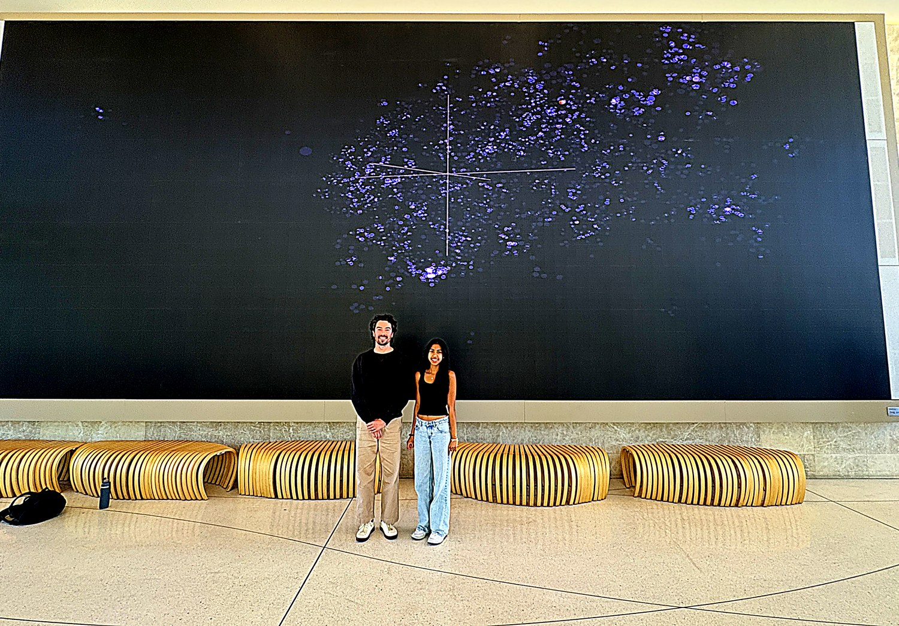

# Three Ways of Seeing

A real-time, interactive art installation that turns a machine's understanding of language into something a whole room can walk up to and add to. A visitor types a word, and it appears live inside a 3D map of meaning, floating among the words a language model considers most like it.

<p align="center"></p>
<p align="center"><em>The piece running on a 34 by 15 foot wall. Words a room has typed in, arranged by a model's sense of what they mean.</em></p>

## The idea

*Type in any word.*

This piece explores our efforts to find connection in the absence of shared context, a condition that describes most of our relationships. It isolates and abstracts words from my poetry, the most vulnerable externalization of myself, into anonymous points in space, allowing only glimpses into my expression.

I invite viewers to offer their own words in a limited, fragmented attempt at connection. As you add a word, your vulnerability incites reciprocation, and the cluster reveals the closest neighboring words. The cluster absorbs these contributions, as identity is continually shaped through contact with others. We never have full context when we reach toward someone. We offer what we have and hope something meaningful returns.

Each word is encoded as an embedding and positioned within an evolving t-SNE cluster, a mathematical attempt to reduce multidimensional meaning into a 3D space. The visualization keeps clustering, seeking to generate coherence within fractured expressions.

## How it works

```
Visitor's phone / laptop              Display screen
   add_word.html          WiFi          realtime_exhibition.html
   (type a word)         hotspot        (3D Three.js visualization)
         |                                        ^
         +------------->  Python server  ---------+
                          embed + t-SNE + WebSocket broadcast
```

- **Embeddings:** the `all-MiniLM-L6-v2` sentence-transformer turns each word into a 384 dimensional vector.
- **Projection:** t-SNE reduces those vectors to 3D while preserving which words are neighbors.
- **Rendering:** Three.js draws the point cloud and word labels in WebGL.
- **Live and local:** a Python WebSocket server broadcasts each new word to the display in real time, over a self-hosted WiFi hotspot, so the whole thing runs with no internet. Both pages auto-detect the server address, so there is nothing to configure on the day.

## At the exhibition

<p align="center"></p>
<p align="center"><em>Visitors add words from a phone; the display updates live over a self-hosted hotspot. The words in the cloud, including a few names, were typed in by the room.</em></p>

## Repo layout

- `server.py`, `realtime_server.py`: the embedding, t-SNE, and WebSocket backend.
- `web/realtime_exhibition.html`: the 3D visualization for the big screen.
- `web/add_word.html`: the visitor input page.
- `build_base.py`, `precompute_frames.py`: build the base embedding cloud from source text.
- `config.py`: t-SNE and model settings.
- `SETUP.md`: the full run-of-show setup guide for the physical installation.

The large precomputed embedding caches (`.npy` files) are not committed. Regenerate them with `build_base.py`.
